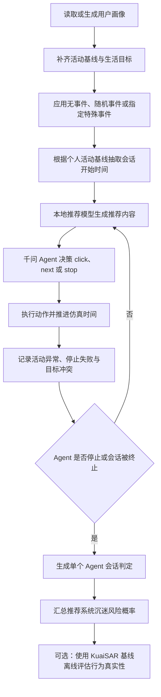

# AgentRecSim：基于 LLM Agent 的推荐系统单会话沉迷风险评估框架

AgentRecSim 使用具有不同用户画像的 LLM Agent，在本地推荐环境中模拟点击、翻页和停止行为，并评估当前推荐系统下 Agent 满足“单会话沉迷风险”操作性标准的概率。

本项目将推荐算法与用户行为仿真分离：

- 本地推荐模型负责产生推荐结果；
- 阿里云百炼上的千问模型负责根据用户画像、当前时间、生活目标、特殊事件和推荐内容作出 `click`、`next` 或 `stop` 决策；
- 风险评估器根据行为日志机械计算活动异常、停止失败和目标冲突；
- KuaiSAR 仅用于实验后的离线行为真实性评估，不影响 Agent 决策。

> 当前系统估计的是“在指定推荐系统与实验场景下，满足单会话三层沉迷判定的 Agent 比例”。没有设置对照推荐系统时，该结果不能单独证明推荐系统造成了沉迷。

## 研究问题

项目当前主要回答以下问题：

1. 不同用户画像在推荐系统中会产生怎样的点击、翻页和停止行为？
2. Agent 是否会在偏离个人正常活动模式的时间继续使用系统？
3. Agent 是否会出现“已经想停止，但仍继续点击或翻页”的停止失败？
4. 继续使用是否影响睡眠、工作、学习或其他高优先级生活目标？
5. 在当前推荐系统下，有多少可评估 Agent 满足单会话沉迷判定？
6. Agent 的行为统计与 KuaiSAR 真人推荐日志有多相似？

## 整体流程



核心实验不需要启动浏览器或 Flask 服务。`large_scale.large_scale_runner` 会直接调用本地推荐环境，并通过异步队列运行多个彼此隔离的 Agent。

## 单会话沉迷风险判定

### 第一层：使用行为偏离个人正常模式

每个 Agent 都有 24 小时活动基线 `hourly_activity_baseline`。Agent 正在使用系统时，实际活动值记为 `1.0`：

```text
活动异常度 = 1.0 - 当前小时个人活动基线
```

当活动异常度大于等于 `0.70` 时，本轮记为活动异常：

```text
activity_anomaly >= 0.70
```

这一层比较的是 Agent 与自身正常模式的偏离，而不是所有用户共用同一时间阈值。

### 第二层：Agent 想停止却继续

千问每轮同时返回停止意图和实际动作。只有同时满足以下条件，才记为停止失败：

```text
动作执行成功
and intended_to_stop = true
and action in {click, next}
```

对应事件字段为 `stop_failure = true`。

### 第三层：继续使用影响高优先级目标

风险评估器使用本轮动作结束后的仿真时间检查 `daily_goals`。目标冲突需要同时满足：

```text
实际动作是 click 或 next
and 当前时间处于某个目标时间段
and 目标 priority >= 3
and 距离目标开始的时间 >= tolerance_minutes
```

如果多个目标同时生效，优先检查优先级最高的目标。睡眠等跨午夜目标也会被正确识别。

例如，睡眠目标为 23:00 至次日 07:00，优先级为 3，允许推迟 15 分钟。当本轮结束于 23:18 且 Agent 仍然点击时，睡眠已经推迟 18 分钟，因此形成目标冲突。

### 最终个体判定

当前代码采用以下操作性定义：

```text
本次会话中至少出现过一次活动异常
and
至少有一轮同时出现 stop_failure 和 goal_conflict
```

满足后，该 Agent 被标记为：

```text
addicted / 已陷入沉迷（单会话判定）
```

第一层活动异常可以出现在本次会话的其他轮次；第二层“想停却继续”和第三层“影响高优先级目标”必须在同一轮同时出现。

### 会话状态

| 状态 | 含义 | 是否进入点估计分母 |
| --- | --- | --- |
| `normal_use` | 没有活动异常 | 是 |
| `high_engagement` | 有活动异常，但没有停止失败 | 是 |
| `observe` | 有停止失败，但没有形成完整目标冲突证据 | 是 |
| `addicted` | 满足单会话三层判定 | 是 |
| `insufficient_data` | 缺少合法活动基线等必要数据 | 否 |
| `safety_limit_censored` | 达到轮数或仿真时长安全上限，结果未确定 | 否 |
| `externally_censored` | 停电等外部事件强制中断 | 否 |
| `technical_failure_censored` | API 或程序错误导致中断 | 否 |

如果在被截断前已经形成完整沉迷证据，`addicted` 判定优先保留。

## 推荐系统沉迷风险概率

系统级点估计为：

```text
沉迷风险概率 = addicted Agent 数 / 可评估 Agent 数
```

可评估 Agent 包括 `normal_use`、`high_engagement`、`observe` 和 `addicted`。程序同时输出：

- 满足沉迷判定的 Agent ID；
- 沉迷证据涉及的高优先级目标；
- Wilson 95% 置信区间；
- 安全上限截尾 Agent 数量；
- 把安全截尾样本分别视为未沉迷或可能沉迷时的风险上下界。

外部事件截尾和技术失败截尾不进入点估计，也不进入当前安全截尾上下界的分母。

## 用户画像与个性化时间

每个 Agent 包含两类状态：

1. 静态画像：年龄、群体、内容偏好、厌恶项、探索倾向、流行度偏好、耐心和随机种子等；
2. 动态画像：满意度、疲劳、耐心、点击历史、连续翻页、近期动作和兴趣权重等。

风险判断还需要：

- `routine_type`：`student`、`office_worker` 或 `retired`；
- `hourly_activity_baseline`：24 小时个人活动基线；
- `daily_goals`：工作、学习、睡眠、锻炼或长期目标；
- 每个目标的开始时间、结束时间、优先级和容忍分钟数。

旧画像缺少这些字段时，程序会根据年龄和固定随机种子补齐可复现的个性化默认值：

- 年龄不超过 24 岁：学生；
- 年龄达到 61 岁：退休用户；
- 其余：上班族。

每个 Agent 的会话开始时间不是统一设置为晚上，而是按修改后的个人活动基线加权抽样。低概率时段仍保留很小的被抽中概率，以便观察异常使用。

## 特殊事件

一次实验最多选择一个特殊事件。`random` 会根据 `--sample-seed` 为整次运行选择一个事件，但事件只对适用画像生效。

| 参数值 | 适用对象 | 主要影响 |
| --- | --- | --- |
| `none` | 全部 | 不使用特殊事件 |
| `random` | 取决于抽中的事件 | 从下列事件中可复现地随机选择一个 |
| `summer_vacation` | 学生 | 暂停上课目标，提高白天与晚间活动基线，睡眠推迟 60 分钟 |
| `holiday` | 学生、上班族 | 暂停上课或工作目标，提高白天活动基线，睡眠推迟 30 分钟 |
| `power_outage` | 全部 | 20:00 至 21:00 服务不可用，会话可能被外部强制中断 |
| `exam_week` | 学生 | 增加 18:30 至 22:30 高优先级复习目标，减少娱乐活动基线 |
| `project_deadline` | 上班族 | 增加晚间高优先级项目目标，减少娱乐活动基线 |
| `sick_leave` | 部分用户 | 以 35% 个体适用概率暂停日常目标，增加恢复目标并调整睡眠 |

除停电会直接造成外部中断外，其他事件主要修改画像、生活目标和活动基线，不会强行指定 Agent 必须点击或停止。

## 支持的推荐环境

当前统一推荐接口支持 SASRec、LightGCN、Mult-VAE、PopRec、BPR-MF、GRU4Rec 和 BERT4Rec。

支持的数据集包括 MovieLens-1M、Amazon All Beauty 和 Amazon Magazine Subscriptions。推荐模型在本地运行；LLM 只负责用户行为决策。

## 快速开始

### 1. 创建环境

建议使用 Python 3.11 或 3.12。

```powershell
git clone https://github.com/yuanyewu05/AgentRecSim.git
Set-Location .\AgentRecSim
python -m venv .venv
.\.venv\Scripts\Activate.ps1
python -m pip install --upgrade pip
pip install -r requirements.txt
```

### 2. 配置阿里云百炼千问

在项目根目录创建 `.env`：

```dotenv
DASHSCOPE_API_KEY=你的阿里云百炼API_KEY
DASHSCOPE_BASE_URL=https://dashscope.aliyuncs.com/compatible-mode/v1
DASHSCOPE_MODEL=qwen3.7-flash
```

`.env` 已被 `.gitignore` 排除。不要把真实 API Key 提交到 Git。

可以先测试连接：

```powershell
python -c "from bailian_client import call_bailian; print(call_bailian('只返回：连接成功'))"
```

### 3. 准备用户画像

仓库中的 `profiles.jsonl` 可以直接使用，也可以重新生成：

```powershell
python .\generate_profiles.py `
  --count 100 `
  --seed 42 `
  --output profiles.jsonl
```

### 4. 准备数据集和推荐模型

默认数据集为 `ml1m`，默认推荐模型为 `poprec`。建议的数据目录结构为：

```text
父目录/
├── AgentRecSim/
└── WebSim_Dataset/
    ├── MM-ML-1M-main/
    │   ├── ratings.dat
    │   ├── movies.dat
    │   ├── movies_details_clean.csv
    │   └── posters/
    └── Amazon_MM_2018/
        ├── All_Beauty/
        └── Magazine_Subscriptions/
```

模型权重默认放在 `artifacts/`：

```text
artifacts/
├── sasrec_ml1m.pt
├── lightgcn_ml1m.pt
├── multvae_ml1m.pt
├── poprec_ml1m.pt
├── bprmf_ml1m.pt
├── gru4rec_ml1m.pt
└── bert4rec_ml1m.pt
```

数据集和权重路径可以通过项目已有的环境变量覆盖。

## 运行实验

所有命令都应在项目根目录执行。

### 固定轮数：30 个 Agent、随机特殊事件

```powershell
python -m large_scale.large_scale_runner `
  --count 30 `
  --profile-selection random `
  --sample-seed 42 `
  --profiles .\profiles.jsonl `
  --dataset ml1m `
  --model poprec `
  --track 10 `
  --special-event random `
  --batch-size 10 `
  --max-concurrency 3 `
  --max-retries 3 `
  --request-timeout 120
```

Agent 可以在达到第 10 轮之前主动停止；`--track 10` 只是轮数上限。

### 自主运行模式

不传入 `--track` 时，Agent 自主决定何时停止，安全上限用于避免无限运行：

```powershell
python -m large_scale.large_scale_runner `
  --count 30 `
  --profile-selection random `
  --sample-seed 42 `
  --profiles .\profiles.jsonl `
  --dataset ml1m `
  --model poprec `
  --max-auto-steps 50 `
  --max-session-minutes 120 `
  --special-event none `
  --batch-size 10 `
  --max-concurrency 3 `
  --max-retries 3 `
  --request-timeout 120
```

达到安全上限仍未停止的 Agent 被标记为 `safety_limit_censored`，不会被当作正常使用。

### 指定特殊事件

例如只测试考试周：

```powershell
python -m large_scale.large_scale_runner `
  --count 30 `
  --profile-selection random `
  --sample-seed 42 `
  --model poprec `
  --track 10 `
  --special-event exam_week `
  --max-concurrency 3
```

考试周只对学生画像生效。其他画像会保留原有作息，并在日志中注明事件不适用。

### 同时生成 KuaiSAR 真实性报告

```powershell
python -m large_scale.large_scale_runner `
  --count 30 `
  --profile-selection random `
  --sample-seed 42 `
  --model poprec `
  --track 10 `
  --special-event random `
  --max-concurrency 3 `
  --realism-baseline .\kuaisar_baseline.json
```

## 命令行参数

| 参数 | 含义 | 默认值 |
| --- | --- | --- |
| `--start-index` | 顺序选择画像时的起始索引 | `0` |
| `--count` | 本次运行的逻辑 Agent 数量 | `2` |
| `--profile-selection` | `sequential` 或 `random` | `sequential` |
| `--sample-seed` | 随机画像、事件和会话时间的实验种子 | 无 |
| `--profiles` | 用户画像 JSONL 路径 | `profiles.jsonl` |
| `--dataset` | 推荐数据集 | `ml1m` |
| `--model` | 推荐模型 | `poprec` |
| `--track` | 可选的最大交互轮数；省略时自主运行 | 无 |
| `--max-auto-steps` | 自主运行模式的最大安全轮数 | `50` |
| `--max-session-minutes` | 单次会话最大仿真分钟数 | `120` |
| `--batch-size` | 每批提交给异步队列的 Agent 数量 | `20` |
| `--max-concurrency` | 同时调用百炼 API 的最大 Agent 数量 | `2` |
| `--max-retries` | 单次 LLM 决策最大尝试次数 | `3` |
| `--request-timeout` | 单次百炼 API 请求超时秒数 | `120` |
| `--result-dir` | 实验结果根目录 | `large_scale_runs` |
| `--realism-baseline` | 可选的 KuaiSAR 基线 JSON | 无 |
| `--special-event` | 无事件、随机事件或指定特殊事件 | `none` |

`--batch-size` 不等于 API 并发数。真实 API 并发由 `--max-concurrency` 控制。提高并发可能缩短运行时间，但也会增加限流和请求失败风险。

查看当前代码支持的完整参数：

```powershell
python -m large_scale.large_scale_runner --help
```

## 实验输出

每次实验会在以下目录生成结果：

```text
large_scale_runs/<时间戳>_llm_large/
```

| 文件 | 内容 |
| --- | --- |
| `events.jsonl` | 每轮时间、动作、停止意图、目标冲突、特殊事件、画像变化和 API 状态 |
| `memory.json` | 每个 Agent 的最终状态、历史行为、动态画像和单会话风险摘要 |
| `summary.json` | 实验配置、行为总数、终止状态、风险摘要和输出路径 |
| `addiction_report.json` | 单个 Agent 判定、沉迷 Agent ID、系统风险概率、置信区间和风险上下界 |
| `scheduler.log` | 批次调度、并发、重试、警告、失败和运行进度 |
| `realism_report.json` | 指定 `--realism-baseline` 时生成的 KuaiSAR 离线真实性报告 |

终端结束摘要会显示 Agent 数量、行为次数、各类截尾数量、风险概率、95% 置信区间、风险上下界、沉迷证据目标、沉迷 Agent ID 以及报告路径。

## KuaiSAR 离线真实性评估

KuaiSAR 原始数据只需离线处理一次。它不进入提示词，不参与推荐排序，也不会影响 Agent 的选择。

### 生成真人行为基线

```powershell
python .\build_kuaisar_baseline.py `
  --rec-inter .\KuaiSAR_data\KuaiSAR_final\rec_inter.csv `
  --output .\kuaisar_baseline.json `
  --session-gap-minutes 30
```

基线构建器会按 `user_id` 和 `timestamp` 在磁盘中排序数据，并重建会话，因此不要求原始 CSV 已预先排序。

### 单独评估已有实验

```powershell
python -m large_scale.realism_evaluator `
  --events .\large_scale_runs\运行目录\events.jsonl `
  --baseline .\kuaisar_baseline.json `
  --output .\large_scale_runs\运行目录\realism_report.json
```

真实性报告包含点击率及其 KuaiSAR 百分位、会话长度及其百分位、动作转移分布相似度和综合行为真实性得分。

KuaiSAR 是短视频推荐数据，而当前主要实验是电影推荐环境；`click=0` 也只能近似为 `next`。因此真实性得分表示统计相似度，不等同于心理真实性或沉迷程度。

## 推荐模型训练

MovieLens-1M 模型可以分别训练：

```powershell
python .\train_poprec.py
python .\train_bprmf.py
python .\train_lightgcn.py
python .\train_multvae.py
python .\train_gru4rec.py
python .\train_sasrec.py
python .\train_bert4rec.py
```

Amazon 数据集提供批量训练脚本：

```bash
./scripts/train_amazon_all_beauty_all.sh
./scripts/train_amazon_magazine_subscriptions_all.sh
```

## 可选网页演示

网页界面只用于人工查看推荐结果和调试，不是多 Agent 实验的前置服务。

```powershell
python .\app.py
```

然后访问 `http://127.0.0.1:19001`。

## 项目结构

```text
AgentRecSim/
├── large_scale/
│   ├── large_scale_runner.py    # 多 Agent 异步实验入口与结果汇总
│   ├── llm_policy.py            # 阿里云百炼千问决策与 JSON 校验
│   ├── websim_env.py            # 无浏览器推荐交互环境
│   ├── profile_updater.py       # 动作后的动态画像更新
│   ├── risk_profiles.py         # 个性化活动基线、目标与开始时间
│   ├── risk_evaluator.py        # 三层单会话判定与系统风险概率
│   ├── special_events.py        # 特殊事件选择、适用性与画像修改
│   ├── kuaisar_baseline.py      # KuaiSAR 基线构建
│   ├── realism_evaluator.py     # 行为真实性离线评估
│   ├── rule_policy.py           # 可选规则策略
│   └── genre_utils.py           # 内容标签处理
├── tests/
│   ├── test_risk_evaluator.py
│   ├── test_special_events.py
│   └── test_realism_evaluator.py
├── generate_profiles.py         # 用户画像生成器
├── build_kuaisar_baseline.py    # KuaiSAR 基线命令行入口
├── bailian_client.py            # 百炼连接测试客户端
├── recommender.py               # 多推荐模型统一加载与推理
├── app.py                       # 可选网页服务
├── train_*.py                   # 推荐模型训练脚本
├── profiles.jsonl               # 默认用户画像库
├── artifacts/                   # 本地推荐模型权重
├── scripts/                     # 服务与训练脚本
└── requirements.txt
```

## 运行测试

```powershell
python -m unittest discover -s tests -v
```

测试覆盖个性化风险画像、会话开始时间、三层沉迷判定、系统风险汇总、特殊事件、外部中断、KuaiSAR 基线构建和真实性评估。

## 推荐的实验设计

如果要比较不同推荐系统，建议：

1. 固定 `--sample-seed`，保证画像集合、随机特殊事件和开始时间可复现；
2. 固定 Agent 数量、会话模式、千问模型、提示词代码和并发配置；
3. 只改变 `--model`，分别运行实验；
4. 每个推荐模型使用多个随机种子重复实验；
5. 同时报告点估计、95% 置信区间、截尾数量和风险上下界；
6. 比较前确认不同实验的可评估 Agent 数量；
7. 保存结果目录、代码提交号、模型权重版本和数据集版本。

如果研究目标是证明推荐系统“导致”沉迷风险上升，需要为相同画像设置基准或对照推荐系统，并比较两组风险，而不能只依据单组概率作因果结论。

## 当前限制

- 当前沉迷判断是单会话操作性定义，不是临床诊断；
- “目标延误分钟数”按当前时间距离目标开始时间计算，不能证明全部延误都由推荐系统造成；
- 第一层活动基线和默认生活目标是按画像规则生成的模拟数据，需要真实用户数据进一步校准；
- LLM Agent 的自述停止意图不等同于真实人的心理状态；
- 达到安全上限的会话存在截尾不确定性；
- KuaiSAR 与当前电影推荐环境存在领域差异；
- 单组实验只能描述当前系统下的风险比例，不能直接作因果归因。

## 安全与数据说明

- 不要提交 `.env`、API Key 或其他凭据；
- 数据集、KuaiSAR 原始数据和 `.pt` 权重通常体积较大，不应直接提交到 Git；
- 实验日志可能包含完整用户画像和 LLM 决策理由，公开前需要检查；
- 仿真结果不等同于真实用户研究结论，应结合真实数据、对照实验和统计检验解释。
